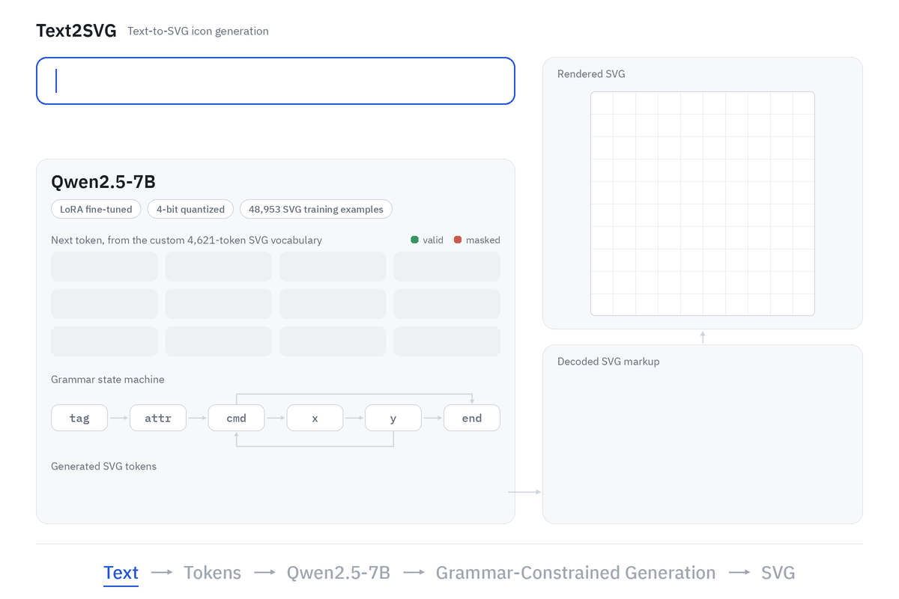
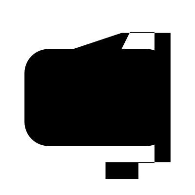
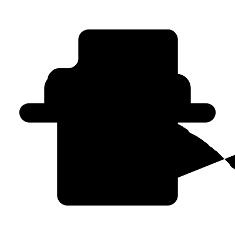
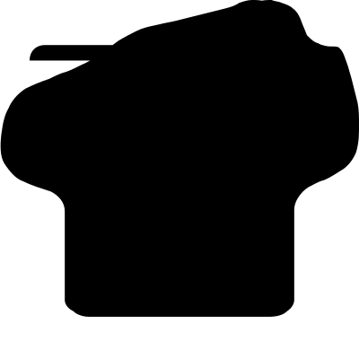
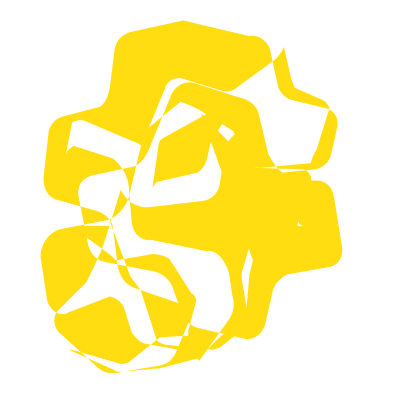

# Text2SVG – Text-to-SVG Icon Generation

Type a description, get an SVG icon. Built on Qwen2.5-7B, trained on
50,000 icons from OmniSVG/MMSVG-Icon.

The model speaks a custom token language: path commands, quantized
coordinates, and packed colours. A grammar state machine masks the
logits at every step so only structurally legal tokens are reachable.
Every output parses. Every output renders.



## What it does

- Tokenizes SVG path data, fill colours, and coordinates into a closed
  4,621-token vocabulary
- Converts arcs to cubic Bézier curves before tokenization, so the
  vocabulary needs no arc-specific tokens
- Fine-tunes Qwen2.5-7B with LoRA and 4-bit quantization
- Constrains generation with a grammar that tracks path state and token
  budget, preventing empty or runaway outputs
- Decodes token sequences back to SVG markup and renders to PNG as well.

## Quick Start

**1. Install dependencies**

```bash
pip install torch transformers peft bitsandbytes accelerate datasets cairosvg
```

**2. Clone the code**

```bash
git clone https://github.com/tdr-lgtm/Text2SVG
cd Text2SVG
```

**3. Download the model**

```bash
pip install huggingface_hub
hf download tdrv8/Text2SVG --local-dir checkpoint
```

**4. Generate an icon**

```bash
python -m svgicon.generate --ckpt checkpoint --prompt "A yellow star icon." --out out
```

Open `out/00_0.svg` or `out/00_0.png` to see the result.

### Default Prompts

Generated four samples for each default prompt.

```bash
python -m svgicon.generate --ckpt checkpoint -n 4 --out results/samples
```

**1. A black coffee cup icon on a white background.**

| Sample 1                                  | Sample 2                                  | Sample 3                                  | Sample 4                                  |
| ----------------------------------------- | ----------------------------------------- | ----------------------------------------- | ----------------------------------------- |
|  |  |  |  |

**2. A simple blue arrow pointing to the right.**

| Sample 1                             | Sample 2                             | Sample 3                             | Sample 4                             |
| ------------------------------------ | ------------------------------------ | ------------------------------------ | ------------------------------------ |
|  |  |  |  |

**3. A yellow star icon with five points.**

| Sample 1                            | Sample 2                            | Sample 3                            | Sample 4                            |
| ----------------------------------- | ----------------------------------- | ----------------------------------- | ----------------------------------- |
|  |  |  |  |

**4. A green checkmark inside a circle.**

| Sample 1                                 | Sample 2                                 | Sample 3                                 | Sample 4                                 |
| ---------------------------------------- | ---------------------------------------- | ---------------------------------------- | ---------------------------------------- |
|  |  |  |  |

> **Note:** The model was fine-tuned on 50,000 SVG icons, so its training data is limited. Some generated icons may appear broken, incomplete, or differ from the intended design. Output quality may improve with more diverse training data and further fine-tuning.


## Checkpoint

| file | size | contents |
|---|---|---|
| adapter_model.safetensors | 323 MB | LoRA weights |
| svg_embeddings.pt | 66 MB | SVG input embeddings |
| svg_lm_head.pt | 66 MB | SVG output embeddings |
| meta.json | — | vocab size, token range, loss history |
| adapter_config.json | — | LoRA configuration |
| tokenizer.json | — | Qwen tokenizer |
| tokenizer_config.json | — | tokenizer settings |


The base Qwen weights are not saved. On load they are pulled fresh from
HuggingFace and the SVG rows are spliced back in.

## File Structure

```text
Text2SVG/
├── svgicon/
│   ├── config.py        # All tunable settings in one place
│   ├── tokenizer.py     # SVG ↔ tokens ↔ IDs
│   ├── arc.py           # Elliptical arc → cubic Bézier
│   ├── grammar.py       # State machine defining legal next tokens
│   ├── vocab.py         # Maps SVG tokens above Qwen's ID space
│   ├── data.py          # Dataset loading and batching
│   ├── model.py         # 4-bit Qwen + embeddings + LoRA + optimizer
│   ├── train.py         # Training loop and checkpointing
│   ├── generate.py      # Constrained generation and PNG rendering
│   └── checkpoint.py    # Save/load, SVG embedding slice only
├── tests/
│   ├── test_arc.py
│   ├── test_tokenizer.py
│   ├── test_grammar.py
│   ├── test_data.py
│   ├── test_model.py
│   └── test_vocab.py
├── README.md
└── pyproject.toml
```

## Training

| setting | value |
|---|---|
| base model | Qwen2.5-7B |
| dataset | OmniSVG/MMSVG-Icon |
| examples | 48,953 |
| epochs | 2 |
| steps | 6,000 |
| final val loss | 0.95 |
| GPU | RTX 5090 |
| time | ~4 hours |

## MMSVG-Icon Dataset Analysis

We use the **OmniSVG/MMSVG-Icon** dataset for our experiments. The dataset analysis is based on a sample of **20,000 SVG examples**. All statistics reported in this section are empirically measured from this sample.

## 1. Structure

### Attributes


Every `<path>` carries exactly four attributes, each appearing 43,923 times
across the sample:

| attribute | values seen | decision |
|---|---|---|
| `d` | varies | **keep** |
| `fill` | varies | **keep** |
| `fill-opacity` | always `"1.0"` | ignore |
| `filling` | always `"0"` | ignore |

A constant attribute carries no information that distinguishes one path from
another, so `fill-opacity` and `filling` are never read.

`filling` is not standard SVG. It appears to be an OmniSVG annotation.

### Canvas

All 20,000 files use `viewBox="0.0 0.0 200.0 200.0"`. No variation at all.

### Size

| Measure           | P50 | P90 | P99 | Maximum | Mean |
| ----------------- | --: | --: | --: | ------: | ---: |
| Paths per file    |   1 |   5 |     |      21 | 2.20 |
| Segments per path |  16 |  50 |  95 |     163 |      |
| Segments per file |     |     |     |         | 49.8 |

Read these as percentiles: p50 is the middle file, p90 is bigger than
nine out of ten files, p99 bigger than ninety-nine out of a hundred.

### Parsing

0 of 20,000 files failed XML parsing.

## 2. Path commands

996,832 commands across the sample:

| command | count | share |
|---|---|---|
| L | 371,360 | 37.3% |
| C | 327,311 | 32.8% |
| A | 108,507 | 10.9% |
| M | 96,075 | 9.6% |
| Z | 93,579 | 9.4% |

All uppercase absolute. No relative (lowercase) forms observed.

### Argument counts

The parser was validated on 20,000 training samples by checking the expected number of parameters for each SVG path command.

* `M` → 2
* `L` → 2
* `C` → 6
* `A` → 7
* `Z` → 0

**Commands with wrong argument count: 0**

### Scientific notation

Some SVG paths contain numbers in scientific notation, such as `1.5e-5`.

For example:

```text
M 7.62939453125e-06 0.0
```

Here, `7.62939453125e-06` is one number, not two separate numbers.

The number parser supports scientific notation to parse these values correctly.

## 3. Colour

### Distribution

43,923 `fill` occurrences, 7,680 distinct values:

| value | count | note |
|---|---|---|
| `""` | 5,506 | empty, no colour specified |
| `currentColor` | 5,014 | inherits from the page |
| `#333333` | 2,439 | |
| `#000000` | 2,008 | |
| `#FFFFFF` | 1,852 | |

**Note on units.** 5,014 is the number of *paths* using `currentColor`;
3,046 is the number of *files* containing it. One file can hold several
paths, so the file count is lower. 3,046 + 16,954 = 20,000. Both numbers are
correct and measure different things.

### The currentColor caveat

Captions for `currentColor` files almost always say "black", most likely
because the file was rendered before captioning and browsers default
`currentColor` to black. So the caption and the file disagree: the caption
asserts a colour the file does not specify.

This is the argument for converting `currentColor` to `#000000`. The decision
here is to keep the dedicated token, on the grounds that it is what the file
actually says. Worth revisiting if the model struggles to connect "black" in
a caption to `COLOR_CURRENT` in the target.

## 4. Arc flattening

Arcs are converted to cubic curves during tokenization, so `PATH_A` never
enters the vocabulary.

### Why

Of the seven arc arguments, only `x` and `y` are coordinates. The radii, the
rotation angle and the two flags are each a different kind of value and would
each need their own token type, plus a grammar with six argument rules
instead of one.

A cubic is six numbers and all six are coordinates, so it reuses tokens that
already exist.

### Verification on 108,507 real arcs

    arcs converted         108,507
    cubics produced        163,470
    cubics per arc         1.51
    arcs returning nothing 12
    wrong endpoints        0
    worst endpoint error   0.00000000 units
    exceptions             0

    pieces per arc
      0 cubic(s)        12
      1 cubic(s)    62,674
      2 cubic(s)    37,731
      3 cubic(s)     7,026
      4 cubic(s)     1,064

One cubic per 90° of sweep, so a quarter-circle needs one and a full circle
needs four. 58% of arcs are under 90°, which is what rounded corners look
like.

**Accuracy.** Maximum deviation from the true ellipse is 5.43e-04 of the
radius. On a radius of 10 that is 0.0054 units, against a coordinate bin of
0.7843 units - **145× smaller than one bin**, so the approximation is erased
by quantisation.

**Worst endpoint error is exactly 0.** The last cubic is snapped to the
requested endpoint, because accumulated floating-point drift would otherwise
leave a hairline gap between an arc and whatever follows it.

### The 12 zero-segment arcs

All 12 were inspected:

    row 5575:  start=(141.233,176.887) end=(141.233,176.887) rx=0 ry=0
    row 10055: start=(138.692,151.489) end=(138.692,151.489) rx=0 ry=0
    row 12547: start=(94.244,82.848)   end=(94.244,82.848)   rx=0 ry=0
    ... (12 total, across 5 files)

Every one has identical start and end points **and** `rx = ry = 0`. The SVG
spec says to omit such an arc entirely - it draws nothing in a browser
either. Returning `[]` is correct and loses no visual information.

They cluster (row 12547 has four), which suggests an export tool emitting
zero-radius rounded corners.

**These are not conversion failures.** The 108,507 figure hides no errors.

## 5. Corrupt Data

`tokenize()` returns `None` if any path value exceeds 10,000. Since the canvas is 200 units, the code treats such large values as suspicious.

Out of 20,000 SVG files, 17 were rejected. The first five inspected files:

* Row 913: 2 paths, largest value `1.5e+16`
* Row 2075: 2 paths, largest value `1.54e+05`
* Row 5011: 1 path, largest value `4.37e+04`
* Row 5818: 1 path, largest value `9.13e+05`
* Row 9305: 7 paths, largest value `2.66e+05`

The smallest of these five largest values is 43,700. This is about 218 times the canvas width of 200 units, so it is an unusually large value.